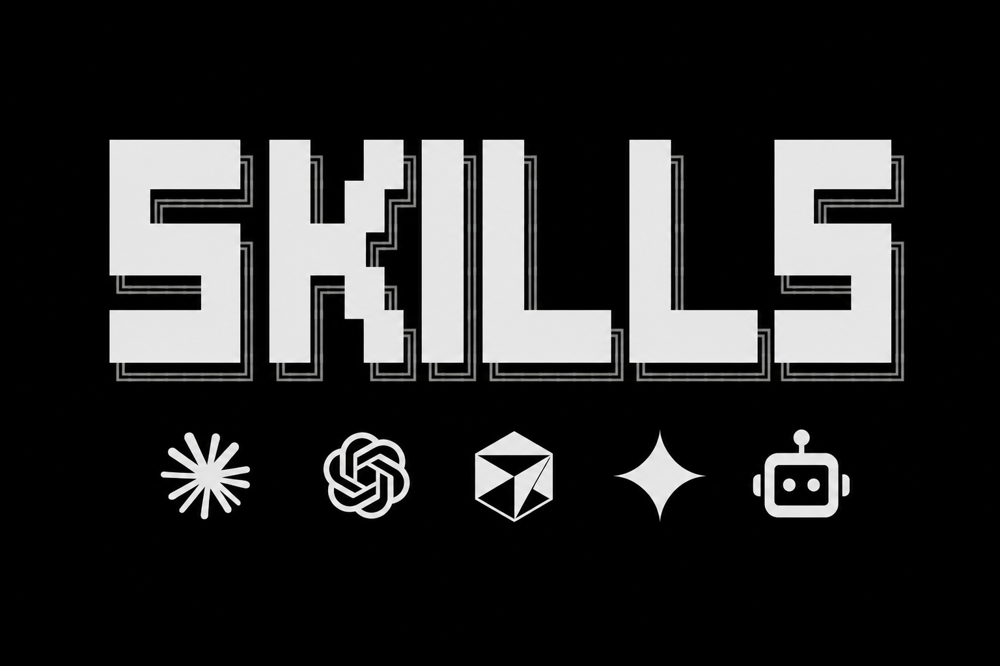

<p align="center">
  
</p>

<h1 align="center">Skills para agentes de IA, en español</h1>

<p align="center">
  <a href="https://x.com/kraayenjon">
    
  </a>
  <a href="https://www.linkedin.com/in/jonathan-kraayenbrink/">
    
  </a>
  <a href="https://aprendevibecoding.com">
    
  </a>
</p>


Las skills que la gente usa a diario, explicadas en español: qué hace cada una, cuándo te sirve y cómo instalarla en un comando.

Sirven para Claude Code, Codex, Cursor, Gemini CLI, Clawbot, OpenCode y el resto de los agentes.

---

## Índice

**Antes de empezar**

- [Por qué existe esto](#por-qué-existe-esto)
- [Qué es una skill](#qué-es-una-skill)
- [Un repo no es una skill](#un-repo-no-es-una-skill)
- [Antes de instalar nada: sentido común](#antes-de-instalar-nada-sentido-común)
- [Cómo instalar](#cómo-instalar)

**El índice**

- [Por dónde empezar](#por-dónde-empezar)
- [Calidad de código y revisión](#calidad-de-código-y-revisión)
- [Diseño y UI](#diseño-y-ui)
- [Ahorro de tokens](#ahorro-de-tokens)
- [Memoria y contexto](#memoria-y-contexto)
- [Entender un codebase](#entender-un-codebase)
- [Marketing, SEO y escritura](#marketing-seo-y-escritura)
- [Investigación y documentos](#investigación-y-documentos)
- [Navegador y automatización](#navegador-y-automatización)
- [Vídeo y multimedia](#vídeo-y-multimedia)
- [Productividad y control](#productividad-y-control)
- [Listas y recursos para seguir](#listas-y-recursos-para-seguir)

---

## Por qué existe esto

Casi todo lo que se publica sobre skills está en inglés: en X, en newsletters y en repos que circulan entre developers angloparlantes. Si no consumes ese contenido a diario, te enteras tarde o directamente no te enteras.

No es un problema de nivel técnico. Es un problema de canal.

Este repo es el índice que a esa gente le falta — qué existe, qué hace cada cosa y cómo se instala, en una sola página.

---

## Qué es una skill

Una skill es una carpeta con un archivo `SKILL.md` dentro. Ese archivo le explica al agente cómo hacer una tarea concreta: revisar código, respetar un sistema de diseño, generar un PDF, escribir un test.

El agente lee solo el título y la descripción al arrancar. Carga el contenido completo únicamente cuando la tarea lo pide. Por eso puedes tener 40 skills instaladas sin que te coman el contexto.

No es un prompt que pegas cada vez. Se instala una vez y queda.

**No confundir con MCP:** un MCP conecta al agente con una herramienta externa (una base de datos, Slack, tu Stripe). Una skill le explica el procedimiento. Son capas distintas y se usan juntas.

---

## Un repo no es una skill

Esta es la parte que confunde a casi todo el mundo, y no la explica nadie.

La mayoría de los repos de esta lista son **packs**: traen varias skills dentro. `mattpocock/skills` no es una skill, son más de 70. `grill-me` y `tdd` son dos de ellas.

Eso cambia cómo instalas:

```bash
npx skills add mattpocock/skills                    # instala el pack entero
npx skills add mattpocock/skills --skill grill-me   # instala solo una
```

Instalar el pack completo cuando querías una sola skill es la forma más rápida de llenar tu agente de cosas que no vas a usar. En la tabla marco con **(pack)** los repos que traen varias.

---

## Antes de instalar nada: sentido común

Una skill no es una librería aislada. Es un archivo de texto que tu agente va a leer y ejecutar **con tus permisos, en tu máquina, sobre tu código**. Trátalo como tratarías a alguien que te pide la llave de tu casa.

Nada de esto es paranoia. Es lo mismo que harías antes de instalar cualquier dependencia.

**Mira el repo, no solo el número**

- Las estrellas miden atención, no calidad. Un repo puede tener 90k estrellas de un hilo viral y no servirte para nada si trabajas en otro stack.
- Mira la **fecha del último commit**. En este ecosistema, tres meses sin tocar es mucho.
- Mira **issues y PRs abiertos**. Si hay gente reportando que rompe cosas y nadie contesta, ya sabes.
- Mira **quién lo mantiene**. Un autor con nombre, historial y otros repos vale más que una cuenta creada el mes pasado.
- Desconfía del repo que apareció hace dos semanas con 50k estrellas y ningún issue. Ese patrón existe.

**Lee el SKILL.md antes de instalarlo**

Es la ventaja de este formato: son 100 líneas de markdown, no 10.000 de código compilado. Puedes leerlo entero en dos minutos.

Busca específicamente si la skill ejecuta comandos, hace peticiones a dominios externos, pide claves API o toca archivos fuera del proyecto.

**Pídele a tu propio agente que lo revise**

Es lo más rápido y casi nadie lo hace:

```
Lee este SKILL.md antes de que lo instale. Dime si ejecuta comandos de shell,
si hace peticiones a dominios externos, si pide credenciales o si modifica
archivos fuera del proyecto. Si algo te parece raro, dímelo sin suavizarlo.
```

**Pruébala antes de que se quede**

```bash
npx skills use owner/repo@nombre --agent claude-code
```

Eso la ejecuta sin instalarla. Si te sirve, la instalas.

**Y luego, lo obvio**

- Instala **de a una**. Si metes 20 de golpe y algo empieza a fallar, no vas a saber cuál fue.
- Pruébalas primero en un proyecto de test, no en el que te da de comer.
- Instala en el proyecto (`npx skills add`) antes que en global (`-g`). Global significa en todos tus proyectos, siempre.
- Si una skill no la usaste en dos semanas, desinstálala. Ocupan contexto y ruido mental.

---

## Cómo instalar

### Opción 1 — `npx skills`

Funciona con cualquier agente, no solo Claude Code.

```bash
npx skills add owner/repo                  # en el proyecto actual
npx skills add owner/repo -g               # global, para todos tus proyectos
npx skills add owner/repo --skill nombre   # solo una skill del pack
```

Probar una sin instalarla:

```bash
npx skills use owner/repo@nombre --agent claude-code
```

### Opción 2 — plugins de Claude Code

Desde dentro de Claude Code:

```
/plugin marketplace add anthropics/skills
/plugin install document-skills@anthropic-agent-skills
```

### Opción 3 — a mano

Copia la carpeta de la skill en `~/.claude/skills/` para tenerla en todos los proyectos, o en `.claude/skills/` dentro de un proyecto concreto.

---


## Por dónde empezar

Si nunca instalaste una skill, empieza por estas cuatro.


| Skill                                                                                       | Qué hace                                                                                                           | ★    |
| ------------------------------------------------------------------------------------------- | ------------------------------------------------------------------------------------------------------------------ | ---- |
| [vercel-labs/skills](https://github.com/vercel-labs/skills)                                 | La herramienta con la que instalas todo lo demás. `npx skills`. Funciona en Claude Code, Codex, Cursor y otros     | 28k  |
| [anthropics/skills](https://github.com/anthropics/skills) **(pack)**                        | Las oficiales de Anthropic. Documentos Office, PDF, diseño frontend. Lo más seguro para arrancar                   | 167k |
| [obra/superpowers](https://github.com/obra/superpowers) **(pack)**                          | El framework de skills más adoptado. No es una skill suelta: es una metodología completa de desarrollo con agentes | 268k |
| [anthropics/claude-plugins-official](https://github.com/anthropics/claude-plugins-official) | El directorio oficial de plugins mantenido por Anthropic. Si dudas de la procedencia de algo, empieza acá          | 33k  |


---

## Calidad de código y revisión


| Skill                                                                                                      | Qué hace                                                                                                                                                               | ★    |
| ---------------------------------------------------------------------------------------------------------- | ---------------------------------------------------------------------------------------------------------------------------------------------------------------------- | ---- |
| [mattpocock/skills](https://github.com/mattpocock/skills) **(pack)**                                       | Más de 70 skills de ingeniería sacadas del directorio real de Matt Pocock. `grill-me` te interroga el plan antes de escribir código, `tdd` te fuerza el ciclo de tests | 208k |
| [addyosmani/agent-skills](https://github.com/addyosmani/agent-skills) **(pack)**                           | Skills de ingeniería de producción, de Addy Osmani (Google Chrome)                                                                                                     | 83k  |
| [wshobson/agents](https://github.com/wshobson/agents) **(pack)**                                           | Marketplace multi-agente: los mismos plugins para Claude Code, Codex CLI, Cursor, OpenCode y GitHub Copilot                                                            | 39k  |
| [EveryInc/compound-engineering-plugin](https://github.com/EveryInc/compound-engineering-plugin) **(pack)** | Plugin de compound engineering: que cada tarea deje el proyecto mejor preparado para la siguiente                                                                      | 24k  |
| [affaan-m/ECC](https://github.com/affaan-m/ECC) **(pack)**                                                 | Sistema completo de optimización del agente: skills, memoria, seguridad y límites                                                                                      | 238k |


---

## Diseño y UI

Esta categoría es la que más rápido se nota. Es la diferencia entre una app que parece vibe-codeada y una que no.


| Skill                                                                                           | Qué hace                                                                                                                                                                             | ★    |
| ----------------------------------------------------------------------------------------------- | ------------------------------------------------------------------------------------------------------------------------------------------------------------------------------------ | ---- |
| [nextlevelbuilder/ui-ux-pro-max-skill](https://github.com/nextlevelbuilder/ui-ux-pro-max-skill) | Criterio de diseño UI/UX para varias plataformas. La más instalada de la categoría                                                                                                   | 114k |
| [Leonxlnx/taste-skill](https://github.com/Leonxlnx/taste-skill)                                 | Le da buen gusto al agente. Evita el diseño genérico de siempre: los mismos violetas, los mismos botones                                                                             | 74k  |
| [pbakaus/impeccable](https://github.com/pbakaus/impeccable)                                     | Un lenguaje de diseño que el agente sigue de forma consistente en todo el proyecto                                                                                                   | 57k  |
| [emilkowalski/skills](https://github.com/emilkowalski/skills) **(pack)**                        | Las skills de Emil Kowalski, el referente de animación e interfaz en la web. Detalle fino: transiciones, microinteracciones, lo que separa una UI correcta de una que se siente bien | 27k  |


---

## Ahorro de tokens


| Skill                                                                 | Qué hace                                                                                                                | ★   |
| --------------------------------------------------------------------- | ----------------------------------------------------------------------------------------------------------------------- | --- |
| [JuliusBrussee/caveman](https://github.com/JuliusBrussee/caveman)     | Recorta un 65% de los tokens haciendo que el agente responda sin relleno ni cortesías, manteniendo la precisión técnica | 97k |
| [DietrichGebert/ponytail](https://github.com/DietrichGebert/ponytail) | Hace que el agente piense como el senior más vago del equipo: el mejor código es el que no escribes                     | 98k |


---

## Memoria y contexto

El problema más caro de trabajar con agentes: cada sesión arranca de cero.


| Skill                                                                                                                                    | Qué hace                                                                                                        | ★   |
| ---------------------------------------------------------------------------------------------------------------------------------------- | --------------------------------------------------------------------------------------------------------------- | --- |
| [thedotmack/claude-mem](https://github.com/thedotmack/claude-mem)                                                                        | Memoria persistente entre sesiones. Captura lo que hace el agente y se lo devuelve la próxima vez               | 90k |
| [upstash/context7](https://github.com/upstash/context7)                                                                                  | Documentación actualizada de librerías inyectada en el contexto. Se acabó el código con la API de hace dos años | 60k |
| [gastownhall/beads](https://github.com/gastownhall/beads)                                                                                | Upgrade de memoria para el agente                                                                               | 26k |
| [OthmanAdi/planning-with-files](https://github.com/OthmanAdi/planning-with-files)                                                        | Planificación en archivos para tareas largas. Si la sesión se cae, el plan sobrevive                            | 26k |
| [muratcankoylan/Agent-Skills-for-Context-Engineering](https://github.com/muratcankoylan/Agent-Skills-for-Context-Engineering) **(pack)** | Colección de skills de context engineering y arquitecturas multi-agente                                         | 18k |


---

## Entender un codebase


| Skill                                                               | Qué hace                                                                                                            | ★    |
| ------------------------------------------------------------------- | ------------------------------------------------------------------------------------------------------------------- | ---- |
| [Graphify-Labs/graphify](https://github.com/Graphify-Labs/graphify) | Convierte un codebase entero — con sus docs, esquemas SQL, configs y PDFs — en un grafo de conocimiento consultable | 104k |
| [yamadashy/repomix](https://github.com/yamadashy/repomix)           | Empaqueta todo un repositorio en un solo archivo listo para pasarle a una IA                                        | 28k  |


---

## Marketing, SEO y escritura


| Skill                                                                                        | Qué hace                                                                                                                          | ★   |
| -------------------------------------------------------------------------------------------- | --------------------------------------------------------------------------------------------------------------------------------- | --- |
| [coreyhaines31/marketingskills](https://github.com/coreyhaines31/marketingskills) **(pack)** | CRO, copywriting, SEO, analítica y growth. Escritas por Corey Haines                                                              | 43k |
| [AgriciDaniel/claude-seo](https://github.com/AgriciDaniel/claude-seo) **(pack)**             | SEO y GEO completo: 25 sub-skills y 18 sub-agentes cubriendo técnico, contenido, schema y visibilidad en buscadores de IA         | 14k |
| [hardikpandya/stop-slop](https://github.com/hardikpandya/stop-slop) †                        | Le quita a tu texto las marcas de que lo escribió una IA. Los guiones largos, el "no se trata solo de", las tres frases paralelas | 15k |


---

## Investigación y documentos


| Skill                                                                                                        | Qué hace                                                                                        | ★   |
| ------------------------------------------------------------------------------------------------------------ | ----------------------------------------------------------------------------------------------- | --- |
| [kepano/obsidian-skills](https://github.com/kepano/obsidian-skills) **(pack)**                               | Le enseña al agente a trabajar con Obsidian y formatos abiertos. De Steph Ango, CEO de Obsidian | 44k |
| [Imbad0202/academic-research-skills](https://github.com/Imbad0202/academic-research-skills) **(pack)**       | Flujo académico completo: investigar, escribir, revisar, corregir, cerrar                       | 41k |
| [Orchestra-Research/AI-Research-SKILLs](https://github.com/Orchestra-Research/AI-Research-SKILLs) **(pack)** | Librería de skills de investigación e ingeniería de IA, para cualquier modelo                   | 11k |


---

## Navegador y automatización


| Skill                                                                              | Qué hace                                                                                    | ★   |
| ---------------------------------------------------------------------------------- | ------------------------------------------------------------------------------------------- | --- |
| [vercel-labs/agent-browser](https://github.com/vercel-labs/agent-browser)          | CLI de automatización de navegador pensado para agentes                                     | 40k |
| [vercel-labs/agent-skills](https://github.com/vercel-labs/agent-skills) **(pack)** | La colección oficial de Vercel. Incluye `web-design-guidelines` y buenas prácticas de React | 30k |
| [mcp-use/mcp-use](https://github.com/mcp-use/mcp-use)                              | Framework para desarrollar MCP Apps y servidores MCP                                        | 10k |
| [huggingface/skills](https://github.com/huggingface/skills) **(pack)**             | Acceso al ecosistema de Hugging Face desde el agente                                        | 11k |


---

## Vídeo y multimedia


| Skill                                                                        | Qué hace                                                                                                                     | ★    |
| ---------------------------------------------------------------------------- | ---------------------------------------------------------------------------------------------------------------------------- | ---- |
| [calesthio/OpenMontage](https://github.com/calesthio/OpenMontage) **(pack)** | Producción de vídeo agéntica: 12 pipelines y más de 100 herramientas                                                         | 46k  |
| [heygen-com/hyperframes](https://github.com/heygen-com/hyperframes)          | De HeyGen. Escribes HTML, te devuelve vídeo. Pensado para que lo maneje un agente, no una persona                            | 40k  |
| [remotion-dev/skills](https://github.com/remotion-dev/skills) **(pack)**     | Las oficiales de Remotion, para hacer vídeo programáticamente con React. `remotion-best-practices` engloba a todas las demás | 4.2k |


---

## Productividad y control


| Skill                                                                                       | Qué hace                                                                                                         | ★    |
| ------------------------------------------------------------------------------------------- | ---------------------------------------------------------------------------------------------------------------- | ---- |
| [multica-ai/andrej-karpathy-skills](https://github.com/multica-ai/andrej-karpathy-skills) † | Un único `CLAUDE.md` para mejorar el comportamiento del agente, derivado de las observaciones de Andrej Karpathy | 200k |
| [davila7/claude-code-templates](https://github.com/davila7/claude-code-templates)           | CLI para configurar y monitorizar Claude Code. Hecho por Daniel Ávila, en español                                | 30k  |
| [jarrodwatts/claude-hud](https://github.com/jarrodwatts/claude-hud)                         | Muestra en pantalla qué está pasando: uso de contexto, herramientas activas, agentes corriendo                   | 27k  |
| [eyaltoledano/claude-task-master](https://github.com/eyaltoledano/claude-task-master) †     | Gestión de tareas para agentes. Funciona en Cursor, Windsurf, Roo y otros                                        | 28k  |


---

## Listas y recursos para seguir


| Recurso                                                                                               | Qué hace                                                | ★    |
| ----------------------------------------------------------------------------------------------------- | ------------------------------------------------------- | ---- |
| [ComposioHQ/awesome-claude-skills](https://github.com/ComposioHQ/awesome-claude-skills)               | La lista awesome más grande de skills. En inglés        | 72k  |
| [hesreallyhim/awesome-claude-code](https://github.com/hesreallyhim/awesome-claude-code)               | Recursos de Claude Code seleccionados a mano. En inglés | 52k  |
| [VoltAgent/awesome-claude-code-subagents](https://github.com/VoltAgent/awesome-claude-code-subagents) | Más de 100 subagentes especializados                    | 24k  |
| [ykdojo/claude-code-tips](https://github.com/ykdojo/claude-code-tips)                                 | Más de 40 trucos de Claude Code, de básico a avanzado   | 9.6k |


---

**†** Sin actualizaciones desde hace más de tres meses. Siguen funcionando, pero el ecosistema se mueve rápido.

Cada repo verificado contra la API de GitHub el 7 de agosto de 2026. Las estrellas cambian rápido: úsalas como señal, no como veredicto.

---

## Licencia

MIT. Cópialo, tradúcelo, fórkealo.

Los repos enlazados tienen sus propias licencias.